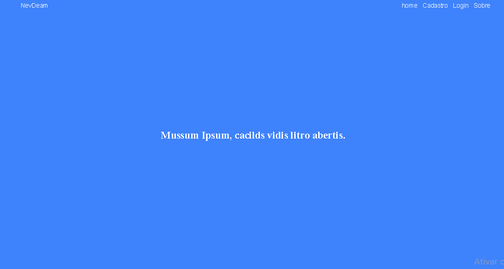

# Paypal-com-node-e-next

Implementação do método de pagamento utilizando o paypal como plataforma. Há dois fronts, sendo o **frontend** a aplicação realizada em next, customizada com alguns produtos de  exemplo e um carrossel feito sem nenhum framework, e o **front** , uma amostra de funcionalidade apenas com um botão de envio para testar no vanilla.
## Frontend com next: 

<div style='text-align: center'>

</div>

<hr>

### Instalação:
É preciso ter a versão LTS do <a href='https://nodejs.org/en/'>Node.js</a> instalada juntamente com o banco de dados postgres em seu computador.
Após isso, basta rodar o comando no terminal:

```
npm install
```
ou
```
yarn install
```
### Banco de dados:
modifique o arquivo **database.js** dentro da pasta back/src/config, colocando as suas configurações.
<hr> 

### 🚀 Tecnologias utilizadas:
  - Javascript;
  - node-js;
  - postgreSql;
  - Next.js;
  - paypal
